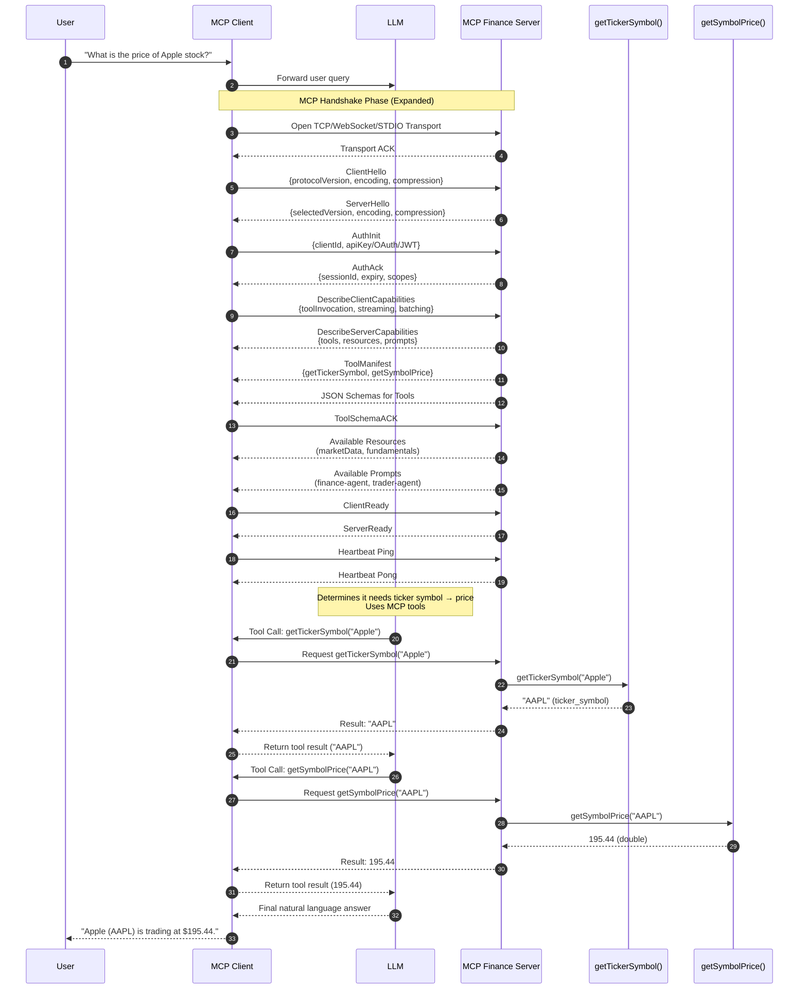

# MCP Server repo for Week3 of GenAI-Bootcamp

Fork this repository to start

Navigate to https://finnhub.io/ and sign-up for a free API key. This API key will be used in the program to access finnhub APIs.

Navigate to `github->clone->codespaces`. This will open the web IDE (VSCode) where your can make code changes.

### Setup Finhub

In the IDE that opens, create a new `.env` file (by right-clicking on the files pane on the left) and adding the following lines (with correct keys):
```sh
FINNHUB_API_KEY=xxxxx
GEMINI_API_KEY=xxxxxx
```

Save the file as `.env`.

### Run the MCP server

Open terminal and type these commands:
- `uv venv`
- `source .venv/bin/activate`

You’re now ready to run the MCP client and servers.
Run client using: 

```sh
uv run mcp_client.py
``` 

Note: It'll show a popup - no need to “Open in browser”.

On the new browser window that opens, use the gradio UI to communicate with your App.

### MCP Inspector

MCP inspector is a debugging tool that uses model-context-protocol to connect to your server. You can use it to ensure your MCP server is up and working correctly.

To invoke MCP inspector tool: 

#### On codespaces:

Note your github url - it should be of the form `https://some-random-prefix.github.dev`.

```sh
$ ALLOWED_ORIGINS=https://some-random-prefix-6274.app.github.dev HOST=0.0.0.0 CLIENT_PORT=6274 SERVER_PORT=6277 npx @modelcontextprotocol/inspector
```
```output
Starting MCP inspector...
⚙️ Proxy server listening on 0.0.0.0:6277
🔑 Session token: d9af2f42281814c74b3dbe001aba833d5c358a06a997b02be110c90e28b55fce
   Use this token to authenticate requests or set DANGEROUSLY_OMIT_AUTH=true to disable auth
```

Note the token from the output.

Open a new tab with url: `https://some-random-prefix-6274.app.github.dev/`
This is MCP inspector tool hosted on your github VM.

On this MCP tool, open "configuration" dropdown and enter 2 values:
 1. Inspector Proxy Address -> https://some-random-prefix-6277.app.github.dev/ (note the port is 6277 not 6274)
 2. Proxy Session Token: copy from MCP-inspector console output.

Hit "connect", and you should see MCP-inspector come to life.

#### Running locally
Simply run: `npx @modelcontextprotocol/inspector`, and ctrl-click the URL it shows in the console, to open it in browser.

## MCP Protocol Details

Here's a sequence diagram of full MCP handshake and communication:




### Appendix

Freely available APIs on finnhub:
```
print(finnhub_client.company_basic_financials('AAPL', 'all'))
print(finnhub_client.company_earnings('TSLA', limit=5))
print(finnhub_client.company_news('AAPL', _from="2020-06-01", to="2020-06-10"))
print(finnhub_client.company_peers('AAPL'))
print(finnhub_client.company_profile2(symbol='AAPL'))
print(finnhub_client.country())
print(finnhub_client.crypto_exchanges())
print(finnhub_client.crypto_symbols('BINANCE'))
print(finnhub_client.filings(symbol='AAPL', _from="2020-01-01", to="2020-06-11"))
print(finnhub_client.financials('AAPL', 'bs', 'annual'))
print(finnhub_client.financials_reported(symbol='AAPL', freq='annual'))
print(finnhub_client.forex_exchanges())
print(finnhub_client.forex_symbols('OANDA'))
print(finnhub_client.general_news('forex', min_id=0))
print(finnhub_client.ipo_calendar(_from="2020-05-01", to="2020-06-01"))
print(finnhub_client.quote('AAPL'))
print(finnhub_client.recommendation_trends('AAPL'))
print(finnhub_client.stock_symbols('US')[0:5])
print(finnhub_client.earnings_calendar(_from="2020-06-10", to="2020-06-30", symbol="", international=False))
print(finnhub_client.covid19())
print(finnhub_client.fda_calendar())
print(finnhub_client.symbol_lookup('apple'))
print(finnhub_client.stock_insider_transactions('AAPL', '2021-01-01', '2021-03-01'))
print(finnhub_client.stock_visa_application("AAPL", "2021-01-01", "2022-06-15"))
print(finnhub_client.stock_insider_sentiment('AAPL', '2021-01-01', '2022-03-01'))
print(finnhub_client.stock_lobbying("AAPL", "2021-01-01", "2022-06-15"))
print(finnhub_client.stock_usa_spending("LMT", "2021-01-01", "2022-06-15"))
print(finnhub_client.market_holiday(exchange='US'))
print(finnhub_client.market_status(exchange='US'))
```

The method

```
@mcp.tool()
def get_stock_history(ticker: str) -> dict:
    """
    Gets last 7 days of historical price for a given stock ticker.
    API: stock = yf.Ticker(ticker)
    """
    try:
        stock = yf.Ticker(ticker)

        history = stock.history(period="7d")

        if history.empty:
            return {"error": f"no history found for this ticker {ticker}"}

        history.reset_index(inplace=True)
        dates = history['Date'].dt.strftime('%Y-%m-%d').tolist()
        prices = history['Close'].tolist()

        return {"dates": dates, "prices": prices}
    
    except Exception as e:
        return {"error": str(e)}

```
